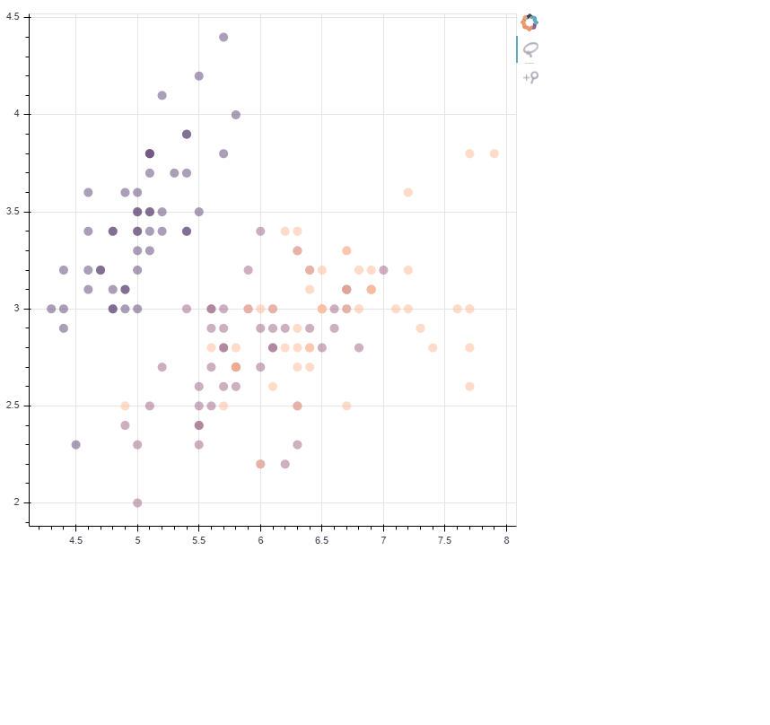
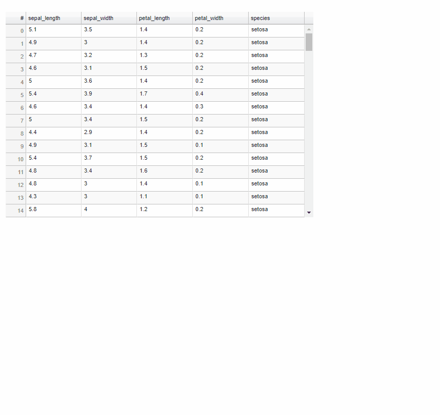
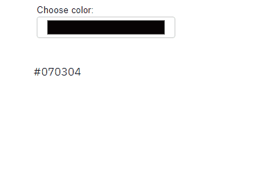
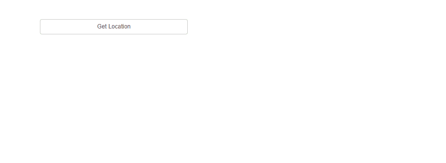
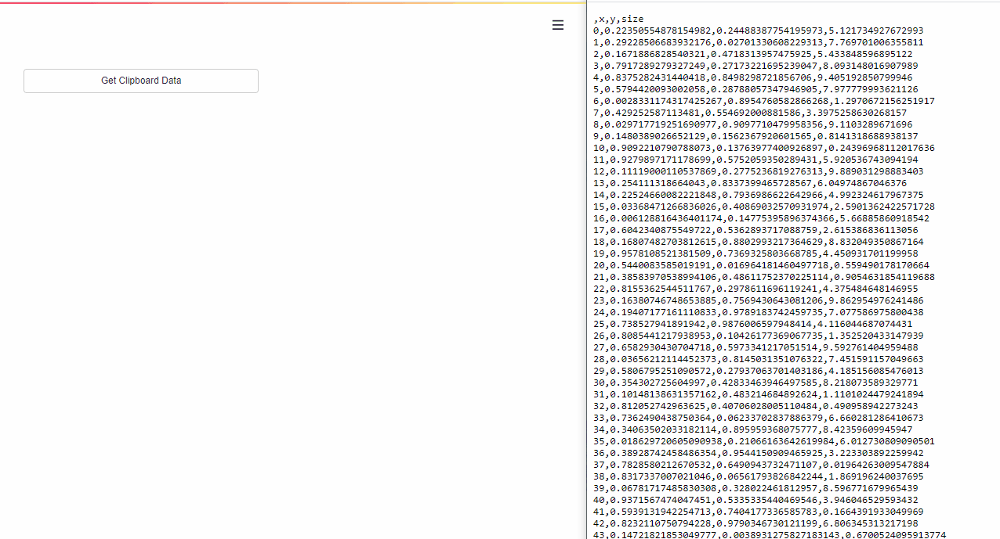

# NOTE
Due to some personal issues I am unable to maintain the project for quite a while.
I am archiving this project and there wont be further updates in it.
Thanks to those who used the package. 

# Streamlit Bokeh Events
A streamlit component for bi-directional communication with bokeh plots.

#### Its just a workaround till streamlit team releases support for bi-directional communication with plots.

## Demo

#### Plots

---
#### Widgets

#### Data Tables


#### Color Picker


#### Run Any Custom JS


#### Get data from Clipboard


## Installation

```bash
pip install streamlit-bokeh-events
```
## Usage

```python
import streamlit as st
from bokeh.plotting import figure
from bokeh.models import ColumnDataSource, CustomJS

# import function
from streamlit_bokeh_events import streamlit_bokeh_events

# create plot
p = figure(tools="lasso_select")
cds = ColumnDataSource(
    data={
        "x": [1, 2, 3, 4],
        "y": [4, 5, 6, 7],
    }
)
p.circle("x", "y", source=cds)

# define events
cds.selected.js_on_change(
    "indices",
    CustomJS(
        args=dict(source=cds),
        code="""
        document.dispatchEvent(
            new CustomEvent("YOUR_EVENT_NAME", {detail: {your_data: "goes-here"}})
        )
        """
    )
)

# result will be a dict of {event_name: event.detail}
# events by default is "", in case of more than one events pass it as a comma separated values
# event1,event2 
# debounce is in ms
# refresh_on_update should be set to False only if we dont want to update datasource at runtime
# override_height overrides the viewport height
result = streamlit_bokeh_events(
        bokeh_plot=p,
        events="YOUR_EVENT_NAME",
        key="foo",
        refresh_on_update=False,
        override_height=600,
        debounce_time=500)

# use the result
st.write(result)
```
